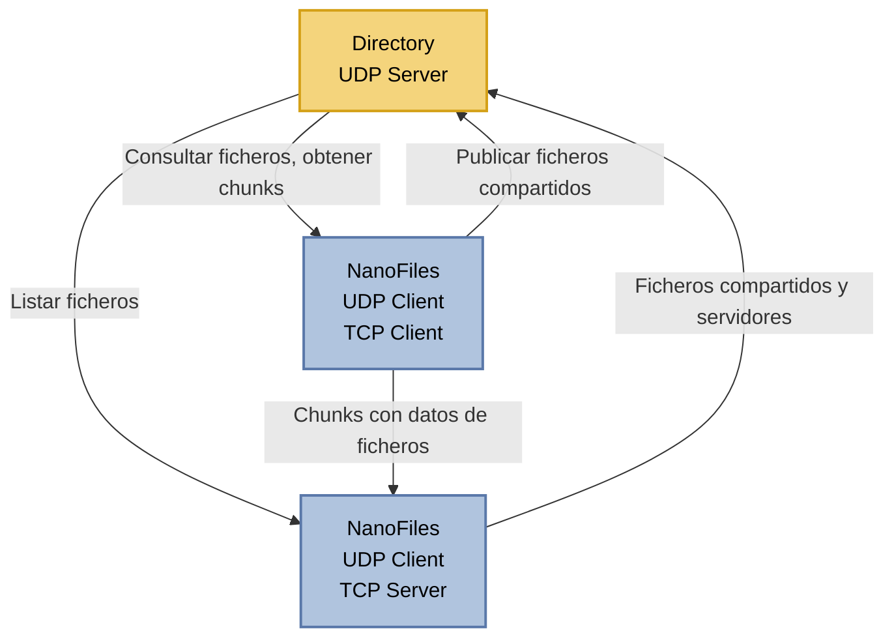

<h1 align="center">Proyecto NanoFilesP2P</h1>

Proyecto de NanoFiles hecho por José Luis Abellán Monreal y Noelia Valarezo Loayza

# Descripción :eyes:

Proyecto de compartición y transferencia de cheros al estilo ```µTorrent```. El proyecto consta de un servidor (Directory) y varios peer (NanoFiles) que se conectan de la siguiente forma:
* Por un lado, la comunicación entre cada peer de NanoFiles y el servidor de directorio se rige por el modelo cliente-servidor. Un peer actúa como cliente del directorio para consultar los cheros que pueden ser descargados de otros peers, publicar los cheros que quiere compartir con el resto de pares y obtener los servidores que comparten un determinado chero.
* Por otro lado, el modelo de comunicación entre pares de NanoFiles es peer-to-peer (P2P)
  * Cuando un peer actúa como cliente de otro peer servidor, el cliente puede consultar los ficheros disponibles en el servidor y descargar aquellos fragmentos (chunks) de un chero determinado que solicite
  * De manera complementaria, un peer puede convertirse a petición del usuario en servidor de ficheros, de forma que escuche en un puerto determinado en espera de que otros peers se conecten para solicitarle fragmentos de los ficheros que está compartiendo.

Diagrama del proyecto:


Un peer puede actuar simultáneamente como cliente y como servidor de cheros (modelo de comunicación P2P). En el sistema NanoFiles, todos los pares son capaces de comprobar si existe un servidor de directorio que utilice un protocolo de comunicación compatible con el del cliente. De esta forma, es posible distinguir al servidor de directorio del propio grupo, de otros servidores de directorio implementados por otros IDs que se estén ejecutando en ese instante en la red local.

# Diseño de mensajes

En este apartado se relatan el formato de los mensajes NanoFiles-Directory y NanoFiles-NanoFiles

## Formato de comunicación con Directory

### Comando ping
  
|Operación|Emisor|Receptor|Campos adicionales|
|:----|:----|:----|:----|
|ping|NanoFiles|Directory|protocolID|

Mensaje para comprobar que el directorio está activo y a la escucha en mi mismo protocolID
* **protocolID:** ID de protocolo para que solo acepte las comunicaciones correctas

|Operación|Emisor|Receptor|Campos adicionales|
|:----|:----|:----|:----|
|pingOk|Directory|NanoFiles|-|

Mensaje de confirmación de que el directorio está a la escucha con el protocolo deseado

|Operación|Emisor|Receptor|Campos adicionales|
|:----|:----|:----|:----|
|pingBad|Directory|NanoFiles|-|

Mensaje para informar que protocolID de Directory es distinto al enviado por un NanoFiles

### Comando download

|Operación|Emisor|Receptor|Campos adicionales|
|:----|:----|:----|:----|
|download|NanoFiles|Directory|fileHash|

Mensaje para conocer cuántos servidores tienen el fichero con hash ```fileHash``` de todos los servidores disponibles
* **fileHash:** Hash del fichero a descargar

|Operación|Emisor|Receptor|Campos adicionales|
|:----|:----|:----|:----|
|downloadServerList|Directory|NanoFiles|serverList|

Mensaje para enviar la lista de servidores que tienen el fichero con hash ```fileHash```
* **serverList:** Lista de servidores sirviendo el fichero solicitado

|Operación|Emisor|Receptor|Campos adicionales|
|:----|:----|:----|:----|
|downloadServerBad|Directory|NanoFiles|-|

Mensaje para informar de que no existen servidores disponibles sirviendo el fichero con hash ```fileHash```

### Comando filelist

|Operación|Emisor|Receptor|Campos adicionales|
|:----|:----|:----|:----|
|filelist|NanoFiles|Directory|-|

Mensaje para mostrar la lista de ficheros servidos en Directory

|Operación|Emisor|Receptor|Campos adicionales|
|:----|:----|:----|:----|
|filelistOk|Directory|NanoFiles|fileList|

Mensaje para devolver la lista de ficheros en Directory
* **fileList:** Lista de ficheros sirviéndose en Directory

|Operación|Emisor|Receptor|Campos adicionales|
|:----|:----|:----|:----|
|filelistBad|Directory|NanoFiles|-|

Mensaje para informar de que no se ha podido recuperar la lista de ficheros

### Comando serve

|Operación|Emisor|Receptor|Campos adicionales|
|:----|:----|:----|:----|
|serve|NanoFiles|Directory|port, fileList|

Mensaje para empezar a servir los ficheros ```fileList``` en el puerto ```port```
* **port:** Puerto donde quieres empezar a servir ficheros
* **fileList:** Ficheros que quieres empezar a servir (nombre, tamaño, hash) separados por ```%```

|Operación|Emisor|Receptor|Campos adicionales|
|:----|:----|:----|:----|
|serveOk|Directory|NanoFiles|-|

Mensaje para informar de que se puede comenzar a servir los ficheros correctamente

|Operación|Emisor|Receptor|Campos adicionales|
|:----|:----|:----|:----|
|serveBad|Directory|NanoFiles|-|

Mensaje para informar de que no se pueden servir los ficheros o el puerto está ocupado previamente

### Comando quit

|Operación|Emisor|Receptor|Campos adicionales|
|:----|:----|:----|:----|
|quit|NanoFiles|Directory|-|

Comando para dar de baja mis ficheros que estén sirviéndose

|Operación|Emisor|Receptor|Campos adicionales|
|:----|:----|:----|:----|
|quitOk|Directory|NanoFiles|-|

Mensaje para informar de que los ficheros de han dado de baja correctamente

|Operación|Emisor|Receptor|Campos adicionales|
|:----|:----|:----|:----|
|quitBad|Directory|NanoFiles|-|

Mensaje para informar de que no se han podido dar de baja los ficheros

### Comando upload

|Operación|Emisor|Receptor|Campos adicionales|
|:----|:----|:----|:----|
|upload|NanoFiles|Directory|fileHash, server|

Mensaje para subir un fichero a otro Directory
* **fileHash:** Hash del fichero a subir
* **server:** (IP, puerto) del Directory al que quieres servir el fichero

|Operación|Emisor|Receptor|Campos adicionales|
|:----|:----|:----|:----|
|uploadOk|Directory|NanoFiles|-|

Mensaje para informar de que se ha subido correctamente

|Operación|Emisor|Receptor|Campos adicionales|
|:----|:----|:----|:----|
|uploadBad|Directory|NanoFiles|-|

Mensaje para informar de que no se ha podido compartir el fichero

## Autómatas

